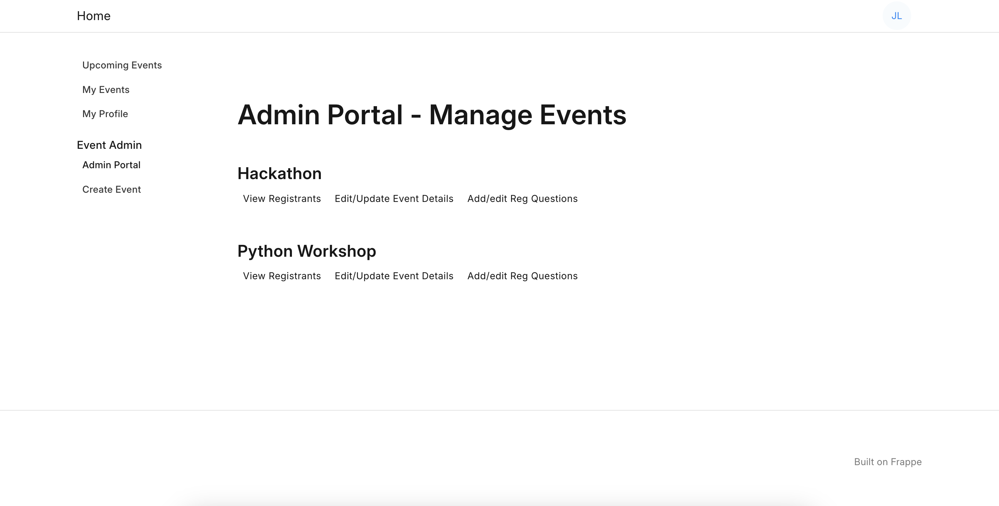

# Event Management App

A web application built on the Frappe framework for managing specific campus communities. This enables admins to manage different community chaptersand associated events.

## Features

- **Community Chapter Management**: Keep track of community chapters spread across different colleges, including the members of each chapter and related events.
- ****
- **Event Creation**: Campus leads and event admins can create public events or events exclusive to college students.
- **Attendance Tracking**: Record attendance of event registrants efficiently.
- **Skill Enhancement**: Add skills to learner profiles upon event completion.
- **Assignments**: Pose assignment questions to engage participants.
- **Feedback Collection**: Gather valuable feedback from event attendees.

## Role Permissions
- **Learner**: All community members are assigned the learner role.
- **Event Admin**: Each chapter can have multiple event admins. Create and manage events under their respective chapter.
- **Campus Lead**

## Screenshots

### Dashboard

### List events on website

### Admin Portal

### Customize event registration forms
