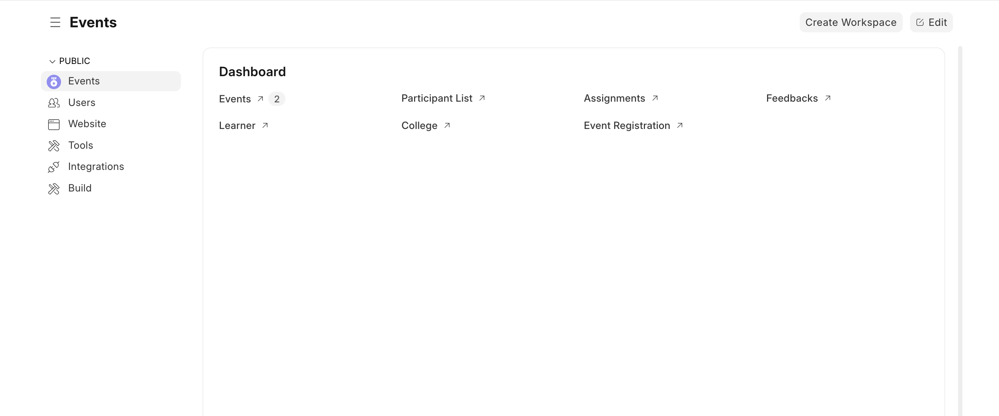
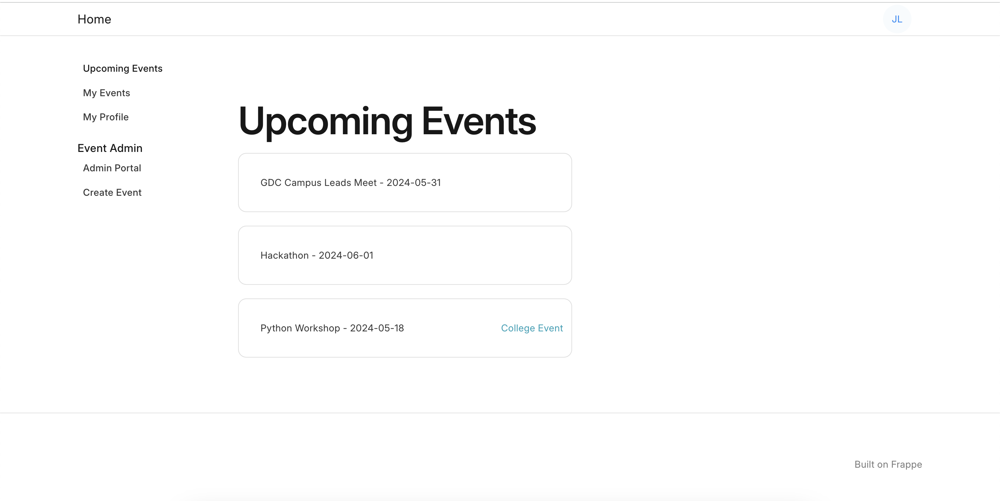
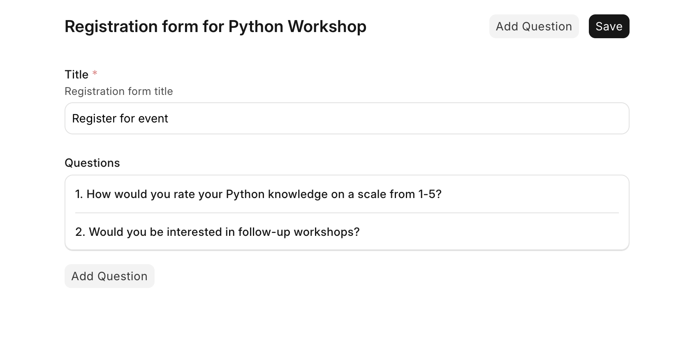

# Event Management App

A web application built on the Frappe framework for managing specific campus communities. This enables admins to manage different community chaptersand associated events.

## Screenshots

### Dashboard

### List events on website

### Customize event registration forms

### Admin Portal
